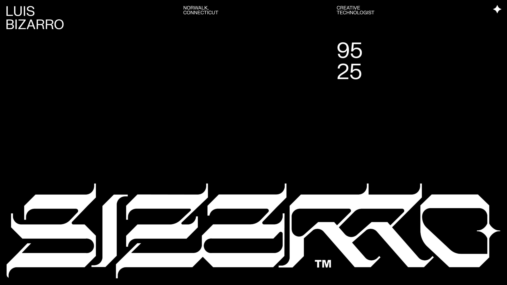

# Luis Bizarro Portfolio

[](https://bizar.ro/)

Luis Bizarro's portfolio from 2024. [Site of the Day on Awwwards at June 14, 2024.](https://www.awwwards.com/sites/luis-bizarro)

# Overview

My previous portfolio was starting to feel outdated, so I wanted to create something fresh that highlights my best projects through videos and WebGL effects. I opted for a clean, simple approach, reusing a design originally crafted by my friend [Kacper Chlebowicz](https://kacper.ch/). The site features [OGL](https://github.com/oframe/ogl) for mouse fluid effects and [Lenis](https://lenis.darkroom.engineering/) for smooth scrolling, while the rest is built with plain JavaScript. Recently, I’ve been transitioning to my own framework and now use TypeScript across all my personal and commercial projects. However, I’m reserving this framework for future open-source endeavors.

# Quick Start

```sh
# Clone the project.
git clone https://github.com/bizarro/2024.git

# Install npm depedencies.
npm install

# Configure .env variables and run the website.
npm start
```
