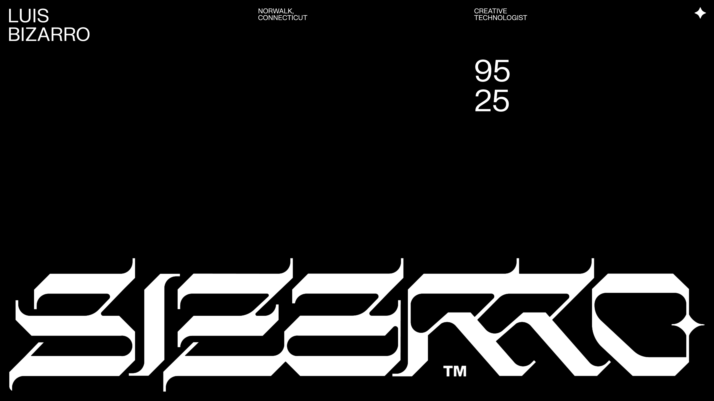

# Luis Bizarro Portfolio

[](https://bizar.ro/)

Luis Bizarro's portfolio from 2024. [Site of the Day on Awwwards at June 14, 2024.](https://www.awwwards.com/sites/luis-bizarro)

# Overview

My previous portfolio was starting to feel outdated, so I wanted to create something fresh that highlights my best projects through videos and WebGL effects. I opted for a clean, simple approach, reusing a design originally crafted by my friend [Kacper Chlebowicz](https://kacper.ch/). The site features [OGL](https://github.com/oframe/ogl) for mouse fluid effects and [Lenis](https://lenis.darkroom.engineering/) for smooth scrolling.

The site runs on the [Lisergia](https://lisergia.dev/) stack: TypeScript everywhere, [Preact](https://preactjs.com/) server-side rendering with [Elysia](https://elysiajs.com/) on a Cloudflare Worker, and a [Vite](https://vite.dev/)-based client build via `@lisergia/cli` (SCSS, GLSL and SVG sprites included). Static assets are served by Cloudflare Workers Static Assets.

# Quick Start

```sh
# Clone the project.
git clone https://github.com/bizarro/2024.git

# Install dependencies.
bun install

# Run the website (Vite dev server + wrangler dev).
bun run dev

# Type-check.
bun run check-types

# Deploy to Cloudflare.
bun run deploy
```
